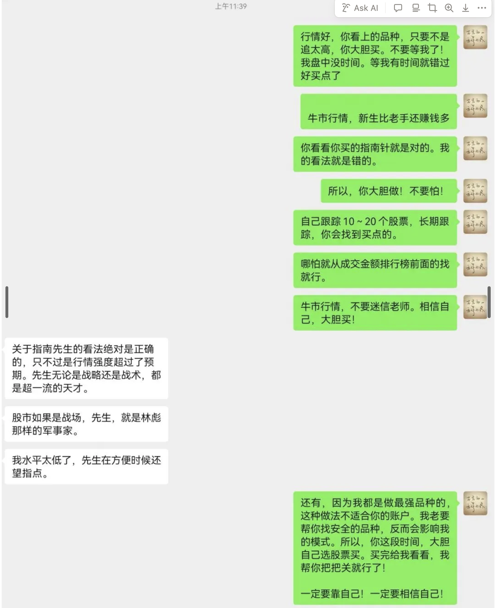
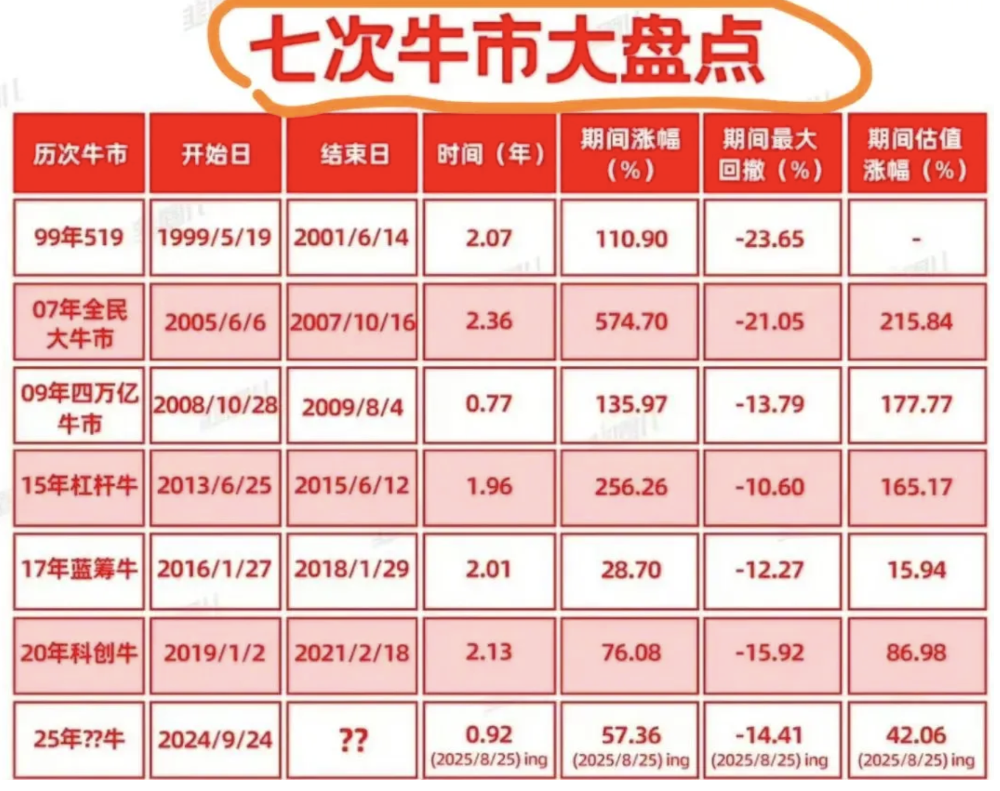

### 2025年10月21日16:26:54

说在成交量100之前选的股票大多数事都已经长得很高的票了呀要是搞不懂，就这样买进去，不是去站岗的问题吗？ 好多股票刚开始涨的时候不会进入前100 前100是指当天还是指昨天以前的？ 开始的时候我对这个问题也很疑惑后来经过慢慢的梳理目前好像也懂了一些皮毛 第一成交量100之前的股票不是单一看今天或者昨天的要一直跟踪才能有效果在这100里面，有的票是刚涨上来的有的票是前面涨了很高，成交量放大才进来的有些票是盘子很大，一直蹲在那里，光占茅坑不拉屎的这就需要我们用心的去分析各个股票的属性就像我哥教过的买一只股票要长期的去跟踪它就是这个道理 第二怎样在这100里面选股票呢前面上涨的太多的就不要去凑热闹了等它回调的时候去分析市场的各种数据找到自己认为已经调整得差不多的时候这时候才考虑去建仓这种情况买的早了，后面还会继续调整买得晚了说不定一下它又飞上去了最好的方法就是先打底仓，不断的去做t或者买错了，及时的止损等待后面调整到位了再上 要是找到那种刚开始趋势上涨的股票恭喜你后面等着吃大肉吧

对于那种刚开始涨还没有进前100的股票

怎么能发现它呢？我哥教我的去看当前最热门的板块哪些前面已经涨起来了那些还没有涨，正准备涨的这时候那个个股的成交量都不会是很大所以没有进前100要发现它必须不能懒多用心的去复盘能找到这种股票，肯定是最安全的

为什么要去找成交量大的股票来买卖呢？买股票就跟做实业一样有人气，有资金朝那个方向凑热闹肯定会好的多这种票比较安全大资金比较喜欢因为只有在这种票才能进出自由虽然有时候不能赚很多的利润，但是跌的时候也不会太难看那种小盘股又没有量的涨的时候，也许是别人在操盘跌起来几个地板让你哭都来不及 我目前对于这种大道理能说一片一片的这些都是我哥教过我的以我的水平理解能说到哪到哪但是到了我自己实际去实施的时候往往都会做的一团糟

### 2025年09月25日14:07:27

券商互联网金融板块只要有点蠢蠢欲动，明显有资金在打压，不让它们涨！这些神秘的打压资金，明显是GJD性质的量化团队干的！

继续低吸有傻子慌慌张张杀跌卖出的品种。我准备持有科技股过节。最多加一点稀土对冲。 我认为慢牛走势不会改变。涨高的卖出，低吸调整到位的品种。 这种时候，要有耐心。

你只要在科技大主线里跳跃，赚多赚少完全看运气了！但肯定能赚！你们如果看了吴村长讲话里的“含科量”，就知道买科技股是ZZ正确的选择了！ 只买大科技主线不动摇！其他不看！ 行情无忧！继续看多做多！

---

我再说一遍： 普通散户，你只能在指数单边上涨的阶段，可以轻松赚钱。 震荡调整行情，少数人可以赚钱。而且许多人赚钱仅仅是因为运气好。

下跌趋势行情，99%的人，包括好运哥，都会亏钱的。 你领悟了这个规律，在指数单边上涨的阶段，猛攻！能赚多少赚多少！不要客气！行情进入震荡调整时期，降低仓位，凭运气打猎。行情单边下跌，一定要空仓退出。

### 2025年09月16日12:15:59

6，国庆节长假前， 有点担心成交量萎缩。但有去年的9.24行情记忆，我相信没有几个人敢空仓过国庆节假期。所以，盘中有急跌，你愉快买你一直跟踪看好的品种，就是好交易。低吸高抛，别做反了！ 继续看震荡行情，调整不会深。有杀跌要敢于买！买大科技！买杀跌的券商互联网金融！别追高买股票，这个简单策略足够了！ 不慌！

### 2025年09月15日16:30:53

股市走势，本来就因为各种因素影响，充满各种不确定性。正确的炒股方法，就是在预判各种可能走势的基础上，根据行情真实走势，去进行应对。 只有骗子，才能对你言之凿凿地保障“一定涨！”

### 2025年09月10日11:44:07

慢慢炒股，钱慢慢赚，不要那么心急，

你那**（已打码内容）**算临时起意买的，迅速处理了。去换成交金额排行榜前30的品种买卖。别跑偏了！

你买成交金额排行榜前30的品种，成功率很高。要坚持。

以后千万记住，别买那种成交金额小的品种。完全没有确定性。

没有长期跟踪过的品种，不要买。这属于临时起意，没有确定性。完全是散户思维方式。

调整行情，涨幅大于3%以上，打死都不能买了，这是铁的纪律。

你自己涨3%就跑得飞快，别人也是一样的想法呀！

1，昨天下午收盘就有这样的预判， 好运哥还是有点东西吧？逻辑很简单！一轮行情，就一个“最主线”，要信，你就坚持信！低位要敢买，就行啦！ 多简单呀！

领涨的是AI算力，CPO，大科技主线品种！领跌的是昨天领涨的固态电池，黄金。 还是轮涨格局。

港股不跌，A股怎么好意思跌？不存在的！ 现在重点还是要看成交量的变化。如果成交量不能有效放大，还是轮涨格局，就不要追高买。如果成交量放大，就可以适当追涨主流热点板块！ 就是这么简单！说起来是一种动态的应对。看各位的反应能力了。

1，今天指数没有迅速反包， 需要警惕短期调整来临了。早盘一度超过4000上涨，同花顺领涨。但因为没有形成市场共识，也没有主流板块跑出来，又慢慢萎下去了！ 前期热点稀土在跌幅前列。市场情绪有点冷却。不好玩呀！

3，我对市场的认知和敏感， 可能真的老了！ 正如每轮牛市行情，我都赚证券板块的钱，赚得很轻松。我2014年起，从证券板块赚的钱，肯定超过了5000以上，于是形成了路径依赖。 最近几年，同样的轻松赚钱路径，好像很艰难了。我再不转换认知，可能真要被市场淘汰了！

2，下跌第三天不反弹。 第四天继续跌，只能止损了。我已经卖出了，你这个老登可以愉快上涨了！你这个破钱我不赚你还不行吗？垃圾玩意儿！ 抱歉！你们买证券的可能也亏钱了吧？一起亏钱，不丢人呢！

4，现在最好，最有效率的模式， 是看K线强势和成交量在前面的品种搞，成功率很高！以上举例的几个品种，我就是先从成交金额排行榜往下翻，然后找出K线走势漂亮的品种，跟踪多看几天，就会有从容低吸买入的机会。 这个模式，兼顾效率和价值投资，特别适合当前的行情。

3，好运哥旗帜鲜明！ 这么强烈的趋势上涨，不可能一天调整就结束！至少要3次这样的巨幅震荡后，才要小心些！ 今天这样的调整，你放一万个心！

2，1993年开始炒股的好运哥， 经历了至少3～5轮牛市了！我股龄比你们许多读者的年龄还大吧？我对牛市行情的预判和应对，我说肯定是A股市场最顶尖那一小群人！你们觉得我需要谦虚吗？！

### 2025年09月09日16:28:44

按我哥教的方法头一天买的股票既然你已经做好功课，十分的看好他了第二天有低位先打一笔进去看看当天的市场情况要是市场走弱了，就不要动手了要是市场转好了，自己买的股票方向又对了不要犹豫，马上把仓位打上去去做高低切就能做到利润的最大化了

6，券商板块我再提一嘴吧！

一直以来，

券商板块的股性，

已经变得非常猥琐。

只适合低位埋伏，

然后很有耐心的股友，

去赚它们的钱了！

你低位埋伏好，

根本不需要去每天看盘，

哪天有拉升，

你闭着眼睛高位卖出，

赚钱走人就行了！

特别简单！

只要指数转为上升走势，

这样的拉升，

肯定会有！

可以说这样埋伏赚券商板块的钱，

基本上有100%赚钱的把握！

就看你有没有耐心啦！

类似这样的观点，

我至少重复100遍了吧？

而每天留言区，

有大量的留言在讨论券商板块。

很多没有耐心埋伏的急躁股友，

也来掺合这个板块

恨不得券商股票每天都涨！

你们这么急躁，

怎么可能赚这种稳稳的慢钱呢？

大家能明白这个最简单的道理吗？

### 2025年09月08日16:40:11

95%以上的业余散户炒股者，之所以长期炒股不赚钱，最大的原因就是不会“停下来”。 “在容易赚钱的时候参与交易，轻松赚钱。在调整行情和下跌行情，退出交易，空仓应对。” 你只要简单做到这一条，炒股赚钱真的不难的。每年适合交易的行情，大概有3～4段。你每段上升趋势赚个+10～+30%，一年下来，赚+50%～+100%，是很轻松的事情。

如果常年交易，不知道在容易亏钱的时间段停下来，那你99%是不可能从股市赚钱的。

4，不知道有多少人明白这个道理？ 并且能执行到位？当然，像好运哥这样的职业选手，是不受这样的规律约束的。我可以做，你不可以。能明白吗？

## 2025年09月04日12:46:22

6，可能行情节奏会有一些改变。 每周五，下周一上涨，周二周三小调整，周四又开始低吸，然后卖给周五，下周一追高的新入场新韭菜。

但牛市行情，可能她自己做，比我指导她做，收益率还会高一点。你们一定要相信这样的规律。 股市老手，仅仅是比你们防范风险的意识强一点，真到牛市，老手往往赚的没有新手多！ 因为牛市，胆子大就可以赚钱！ 你们也参考一下我这个建议吧！

3，3万亿成交的市场，

谁也没经历过。

还敢买的，

只能说是靠信念炒股了！

你们前面赚嗨了的，

先落袋为安，

暂时退出观望也不算错。

看个人的欲望吧！

ian在正是ShΙ场最恐慌时，指shυdie了80点，不少人迷茫：上zhang是不是结束了？见大顶了？我负责任的告诉你，这不是大顶，只是阶段性顶部，是前两轮牛ShΙ反压线的一次大洗pαn。连日线顶背离都没出xian，行情怎会终结？至于调整多深，我不猜测，底部票无需过度恐慌，只是多耗费点时间而已。

将来真正见最后大顶，得满足一个关键信号：80%以上ban块同时出xian日线ABC顶背离，或周线AB顶背离。一旦这个信号出xian，绝不能抱任何幻想，必须果断应对，大家还记得去年的大底吗？当时提前一个月80%以上ban块同步出xian底背离，就像我当时微博说的“棉裤套皮裤，必定有缘故”，顶底信号从不会孤立出xian。

24年7月：

我毫不含糊地向大伙宣告，这一回2858’点附近的情形跟过往的每一次全然不同，此次居然有超过80%以上的板块和个股齐刷刷地展现出了日线底背离形态。俗话说得好，“棉裤套皮裤，必定有缘故”，这极有可能是牛市启动的序曲，别那么没格局，眼光放长远些，要晓得，如此大范围的一致性底背离形态绝非巧合，而是市场在深沉地传递关键信号

## 好运语录：

好运哥牛市教训：

1，先说一个最重要的结论： 大幅上涨的股票，下跌的时候也会很凶残的下跌的！你们记住这个结论！必须死死记住！下次有相同的场景出现，第一时间跑路！没有低位利润保证，千万别追高买股票！ 这是血泪教训啊！都记住了吗？！

2，下跌的时候， 涨幅大和涨幅小的股票，都会一起下跌！涨幅小的品种，跌幅不见得比涨幅大的品种跌幅小！ 这是又一个重要经验！做补涨品种，只有在上升趋势才有效。调整的时候，会一起下跌！ 这个结论，也请你死死记住了！

3，炒股股，赚钱了， 要随时想到把钱转出去，改善生活！一定要有“赚够了”的思维方式！不然，你一直贪，赚多少钱最后都会换给市场，甚至亏损本金！ 这一条，也希望各位牢牢记住了！！ 以上3条！是本来调整行情给你最深刻的教训！能不能吸取这样的教训，并且运用到以后的交易中，就看各位的执行力了！

你懂得再多，没有执行力，没用的！而执行力是需要自己去练习的！去强化的！这个只能靠自己，没有人可以帮你锻炼执行力的！

4，看来！本轮行情真可以叫“阅兵行情”。 高潮过后，一地鸡毛啊！我也完全没有预判到这样的走势！简直和2008年奥运会行情一模一样！我真的服了！ A股的怂基因，看来是刻在骨子里了！改变不了啦！ 都想“这次不一样”，NND可能再过1万年，还是这个卵样！ 我被打服了！

5，上午成交1.59万亿！ 除非下午V型大反转！全天应该不到2.5万亿成交了！下跌，并且迅速缩量，那就是所有走势里，最不良性的走势了！必须把账户防守放在第一位考虑了！后面有反弹，先别考虑赚钱，先把仓位降下来！别让账户崩溃下跌！已经是最重要的事情了！

如果下午能V型反转，那行情还算正常。如果继续下跌，就说明第一阶段的上涨结束了！小心应对吧！

3，阅兵结束了！ 军工股票跌得一塌糊涂！原来还是以前的炒作套路呀！好运哥提醒几次了，提前退出规避这样的下跌风险，不知道你们听了吗？

5，牛市有恐慌杀跌， 我都是无脑买入的！这已经形成肌肉记忆了！你们慌不慌我不知道，反正有恐慌下跌，我总是笑眯眯地在下面慢慢接，给别人提供流动性的。我心向佛啊！阿弥陀佛！！！ 牛市多急跌。急跌，就是送钱给你！我就是这么简单的结论。反正我不是嘴炮！不但这样说，我也是这样买的！ 买错亏钱！买对吃肉！吃大肉！我心甘情愿呀！

（低位买券商，不要追涨买！不是一天行情！我就提醒这么多了！）

4，我个人判断， 9.3前后，会有比较大的震荡和不确定性。我还是建议保留部分现金仓位，适当防守一下。 当然，你拿的是好品种，就不急卖出。 控制一下节奏。就这么提醒一点点啦！

无奈现在压抑券商板块，是因为需要慢牛，不想让指数疯涨。那你们就耐心点，每天涨+1～+3%，每天涨，涨不停不停涨，不可以吗？为什么一定要涨停板呀？

5，今天周五， 牛市的周五，一半般是上涨的。今天不涨或者涨幅小，是留些幅度给下周一涨。这样控制节奏，也挺好的。 但你看看外资不受我们控制，新加坡的A50指数，就涨得很欢！

6，今天最强的板块是半导体。芯片。 反正你如果用心，每天认真看成交金额排行榜前100名成习惯的人，选股太轻松了！随便选！随便买！ 不信邪去买那些没有成交量的冷门股的，你心情不好，就别怪行情了！丢人呢！

